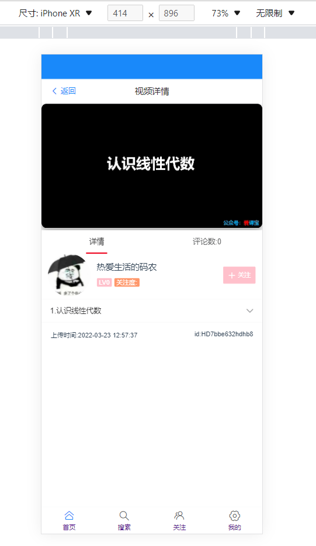

# 一个简单的视频网站项目，为其取名SHINX

## 该项目耗费了数十天，但完成度依旧不高，需要改进，以下为已经实现的功能
1. 登录/注册
2. 视频上传
3. ~~个人信息修改~~(密码和个人空间背景不想写了)
4. 个人空间页面
5. 视频详情，评论功能
6. 搜索视频功能(***别问我为啥不写好友搜索功能,I don't know,I just wanne to be happy!***)
7. 用户关注

## 这里是以后将要实现的功能
1. 用户搜索
2. wechat,ailpay 支付功能(~~也许哪一天哪位大佬借鉴本人项目能赚钱了，记得叫我一声~~)
3. 小广告(***~~只是个小小的广告罢了~~***)
4. 私信功能
5. 加入QQ/微信登录功能？还不如加入手机注册登录@-@

## 以上就是本次软件的更新和将来计划了
### 烫烫烫烫锟斤拷烫烫烫烫锟斤拷烫烫烫烫锟斤拷烫烫烫烫锟斤拷烫烫烫烫锟斤拷

>如果有兴趣可以联系本人**QQ:3307152402**加入本人创建的Q群;
>^-^各位过的愉快

## 文件安装运行步骤
>1. 下载后解压
>2. 确保**node.js环境**的存在
>3. 使用您的编辑器运行 `npm i` 命令
>4. 运行 `npm start` 命令
>5. 如果有需要可以联系本人寻找后端代码和sql文件

## 截图分享
;